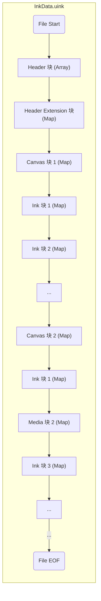

墨迹主文件（`filename.uink`）使用 [MessagePack](https://msgpack.org/) 格式存储，主要存储[墨迹](#)、墨迹归属和元数据。

## 结构规范
1. Header 块是必须的，且必须位于文件开头  
2. Header Extension 块是可选的，但如果有则需要位于 Header 块的下一个块。
3. 1 个 Canvas 块与后方的 n 个 Ink 块 / Media 块组成一个画布。（不允许在第一个 Canvas 块前出现 Ink 块 / Media 块）

## 存储规范
逻辑上拥有相关性的一组墨迹。

### 场景

- **桌面场景**：每块画布应独立保存为单个墨迹文件（以画布清除指令作为分隔多个 .uink 文件的标准）。文件内仅包含一个 Canvas 块，用于表示该独立画布的墨迹数据。  

::: note 提示
特别地，针对桌面多图层场景，允许存在多个 Canvas 块，每个图层对应一个 Canvas 块。  
:::

- **演示文稿/白板场景**：文件内可包含多个 Canvas 块，分别表示每一页或表示每一页中的不同图层。（以逻辑上的一个白板/或对应的一个 PPT 文件作为分隔多个 .uink 文件的标准）  

### 顺序
::: warning 注意
特别地，Canvas 块的呈现顺序是**无序的**。但应将 Canvas 块与后方的 n 个块（直至下一个 Canvas 块或文件末尾前）视为一个整体。  

块们不会依据`Canvas 块`中的逻辑页码或图层层级进行排序。此设计旨在提供流式增量写入功能。如果需要构建画布之间的逻辑结构，则应该读取 Canvas 块中的相关定位信息后自行建立画布结构。  
:::

### 画布表示
Canvas 块与后方的 n 个块（直至下一个 Canvas 块或文件末尾前）视为一个整体，表示为一个画布。  

这些块则按顺序从 Z 序下层至上次表示画布上的内容。简单来讲，按照这些块的正序绘制到画布上，则可以绘制出正确的画布。  

这么做的好处是支持[增量写入](../incremental)。  

## 块规范

### [Header 块](../blocks/header.md)
存储对当前墨迹文件的信息等。

### [Header Extension 块](../blocks/headerExtension.md)
存储对当前墨迹文件的相关说明和绑定 PPT 名称等。  

### [Canvas 块](../blocks/canvas.md)
用于存储墨迹信息和画布内容。  

### [Ink 块](../blocks/ink.md)
存储一条墨迹。

## 相关属性

[块类型（Type ID）](../type.md)  
