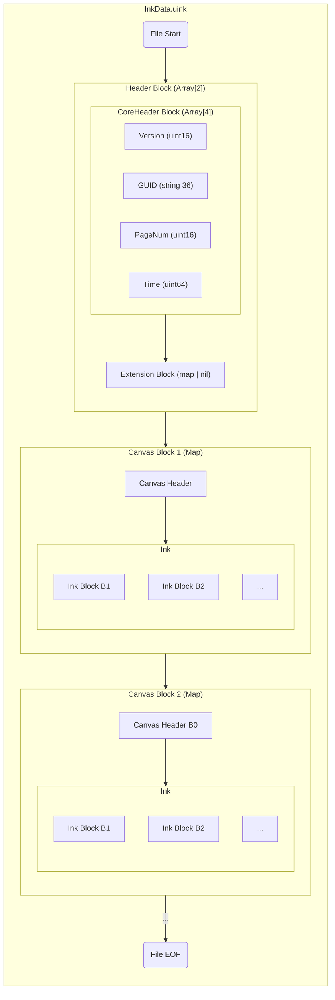

墨迹主文件（`filename.uink`）使用 [MessagePack](https://msgpack.org/) 格式存储，主要存储[墨迹](#)、墨迹归属和元数据。

## 存储规范
逻辑上拥有相关性的一组墨迹。

### 场景

- **桌面场景**：每块画布应独立保存为单个墨迹文件（以画布清除指令作为分隔多个 .uink 文件的标准）。文件内仅包含一个 Canvas 块，用于表示该独立画布的墨迹数据。  

::: note 提示
特别地，针对桌面多图层场景，允许存在多个 Canvas 块，每个图层对应一个 Canvas 块。  
:::

- **演示文稿/白板场景**：文件内可包含多个 Canvas 块，分别表示每一页或表示每一页中的不同图层。（以逻辑上的一个白板/或对应的一个 PPT 文件作为分隔多个 .uink 文件的标准）  

### Header 块
存储对当前墨迹文件的相关说明等。

[详细说明](../blocks/header.md)  

### Canvas 块
用于存储墨迹上下文和画布内容。  

::: warning 注意
特别地，Canvas 块的呈现顺序是**无序的**。  

不会依据`Canvas Header`中的逻辑页码或图层层级进行排序。此设计旨在优化墨迹存储阶段的流式增量写入性能。如果需要构建画布逻辑结构，则应该读取 Canvas 块中的墨迹上下文后自行建立画布结构。  
:::

#### 墨迹归属
存储于`Canvas Header`中，包含其所属的页面编号或该页面下的特定图层索引。  
