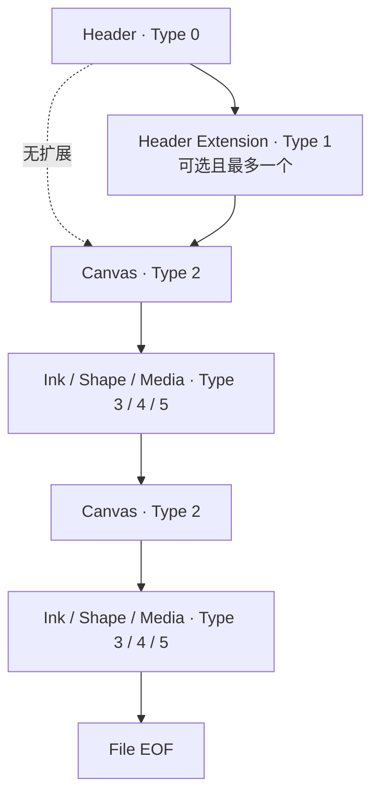

墨迹主文件（`filename.uink`）是连续的 MessagePack 对象流。可选 Header Extension 注册显式 Device 与 Workspace；注册表缺失时使用文件内隐式单例。后续扁平 Canvas 通过 GUID 或隐式单例关联两者，并管理各自的 Ink/Shape/Media。

## 文件结构


```mermaid
flowchart TB
  H["Header · Type 0"] --> HE["Header Extension · Type 1<br/>可选且最多一个"]
  H -. "无扩展" .-> C1
  HE --> C1["Canvas · Type 2"]
  C1 --> B1["Ink / Shape / Media · Type 3 / 4 / 5"]
  B1 --> C2["Canvas · Type 2"]
  C2 --> B2["Ink / Shape / Media · Type 3 / 4 / 5"]
  B2 --> EOF["File EOF"]
```

结构规则：

1. Header 必须位于文件开头。
2. Header Extension 可选且最多一个；存在时必须紧跟 Header。
3. Device 只存在于 Header Extension 的 `devices` 注册表，不是顶级块。
4. Canvas 管理其后的 Ink/Shape/Media，直到下一个 Canvas 或文件末尾。
5. 第一个 Canvas 前不得出现 Ink/Shape/Media。
6. Canvas 可以为空，用于保存空白页或空白图层。

## 两棵注册树与扁平 Canvas

Device 树描述空间：Display 是系统绝对显示区域，Window 是相对父 Device 的窗口或板中板区域。Workspace 树描述场景、宿主、页面序列和父子生命周期。两棵树独立；使用显式注册表时，Canvas 分别用 `deviceGuid` 与 `workspaceGuid` 连接它们，缺失的注册表则按隐式单例解释。

一个文件可以同时包含多个白板、屏幕批注或 PPT Workspace。子 Workspace 合成在父项之上；同级 Workspace 按注册表从前到后合成，后项位于前项之上。Canvas 的显示视口始终填满所引用的 Device，但 Canvas 可以通过可选 viewport 保存该 Device 正在查看的世界坐标区域。

同一页面和 Device 内，`layerIndex` 越大越靠前。Window Device 按 `zIndex` 合成，同值时后注册项位于前注册项之上。以上顺序不依赖 Canvas 的物理排列。

## Device 与 Canvas viewport

Device 回答“显示视口位于屏幕或父 Device 的哪里”，Canvas.viewport 回答“该视口正在查看 Canvas 世界坐标的哪里”。两者的 `x/y` 属于不同坐标空间，不得混用。

Device 局部坐标和 Canvas 世界坐标都使用平台无关的逻辑像素。Canvas.viewport 使用左上角 Canvas 世界坐标 `x/y` 和统一 `scale`；`scale = 1` 时一 Canvas 单位对应一 Device 逻辑像素。内容坐标不随 viewport 改变。

viewport 归属于 `(workspace, device, pageGuid)`，缺失 GUID 时按隐式单例解释。同页同 Device 仅 `layerIndex = 0` 保存 viewport，其他图层继承该值；不同 Device 可以分别保存自己的最终视口。第 0 层缺失或无效时按 `{ x: 0, y: 0, scale: 1 }` 加载。

## 页面与多显示器

`pageGuid` 是页面的永久身份，`pageIndex` 是 Workspace 内可重排的当前顺序。同一 Workspace 中，跨设备或跨图层表示同一逻辑页的 Canvas 必须共享二者。

- 同步白板：多个 Device 引用同一 Workspace 和同一页面身份，只同步页序与翻页；各 Canvas 的绘制内容独立。
- 独立白板：不同 Device 使用不同 Workspace，各自维护页面序列。
- PPT：Workspace 保存宿主 `hostId`，Canvas 保存 `slideId`；跨设备的同一幻灯片共享 pageGuid 和 slideId。

Header.pageNum 是最近一次完整保存时各 Workspace 不重复 pageGuid 的总数。空白页计数，同页多设备或多图层不重复计数；增量追加后读取器以实际 Canvas 重算当前页数。

## 内容与撤回顺序

同一 Canvas 中 Ink、Shape 与 Media 按物理块顺序混合处理，`contentId` 按此顺序从 0 连续递增。擦除 Ink 按顺序作用于其下方内容；读取器不得按块类型重新排序。

`undoId` 在同一 Canvas 的 Ink/Shape/Media 间共享，从 0 开始且只允许不递减。相同 undoId 的连续块构成一次撤回操作。撤回或重做必须完整重写，重写后的文件只保存当前有效内容。

Ink 和 Shape 可以使用 `renderOnlyWhenLatest`。读取器忽略 Media，从 Canvas 尾部识别连续的标记 Ink/Shape；只有末尾标记组显示，其他标记内容隐藏。该显示规则不合并 undoId，被结果隐藏但未撤回的原稿仍属于完整保存内容。

## `.uink.extra`

Media.path 引用对应 `.uink.extra` ZIP 内的资源。ZIP 没有额外索引；资源顺序、几何、播放、PDF 页状态和撤回信息均由 Media 块决定。完整保存先提交资源包，再原子替换 `.uink` 主文件；新资源包必须暂时保留旧、新主文件引用资源的并集，主文件提交后才可以清理多余条目。主文件是当前有效内容的权威来源。

资源包缺失时基础墨迹必须正常加载。视觉媒体保留布局占位；PDF 还可以使用可选 pageCount/pageIndex 显示页数占位信息。

## 容错

- EOF 内的不完整尾块：丢弃尾块并保留此前完整对象。
- 中间字节无法解码：保留此前对象并停止读取余下字节，不尝试重同步。
- 未知 Type ID：跳过当前完整 MessagePack 对象并继续。
- 未知 workspaceType：按通用白板加载，不执行未知宿主逻辑。
- 未知 deviceType：按临时根显示面加载。
- Device/Workspace 循环：断开问题父引用，作为临时根项加载。
- Canvas 引用缺失：构造临时 Workspace 或根 Device 并警告。
- 无效 Ink/Shape/Media：跳过单块、报告警告并继续。
- 所有临时容错结果都不得回写源文件。

外部导入或包含未知对象的文件默认应另存为。用户明确确认可能丢失未知内容后，软件可以按当前能够理解的有效内容覆盖原文件。

## 多显示器 PPT 可读示例

```jsonc
[0, 10, "5fe30f46-be92-49b6-b921-a60706febf10", 2, 1, 1, 1700000000]
{
  "type": 1,
  "devices": [
    { "guid": "11111111-1111-4111-8111-111111111111", "deviceType": 0,
      "x": 0, "y": 0, "width": 3840, "height": 2160 },
    { "guid": "22222222-2222-4222-8222-222222222222", "deviceType": 0,
      "x": 3840, "y": 0, "width": 1920, "height": 1080 }
  ],
  "workspaces": [
    { "guid": "aaaaaaaa-aaaa-4aaa-8aaa-aaaaaaaaaaaa", "workspaceType": 2,
      "hostId": "INKKEYS-PPT-7B58E2A1", "currentPageIndex": 0 }
  ]
}
{
  "type": 2,
  "workspaceGuid": "aaaaaaaa-aaaa-4aaa-8aaa-aaaaaaaaaaaa",
  "deviceGuid": "11111111-1111-4111-8111-111111111111",
  "pageGuid": "cccccccc-cccc-4ccc-8ccc-cccccccccccc",
  "pageIndex": 0, "pageNumber": 1, "layerIndex": 0, "layerNumber": 0,
  "slideId": 256,
  "viewport": { "x": -320.0, "y": 180.0, "scale": 1.5 }
}
// 第一个 Canvas 的 Ink / Shape / Media
{
  "type": 2,
  "workspaceGuid": "aaaaaaaa-aaaa-4aaa-8aaa-aaaaaaaaaaaa",
  "deviceGuid": "22222222-2222-4222-8222-222222222222",
  "pageGuid": "cccccccc-cccc-4ccc-8ccc-cccccccccccc",
  "pageIndex": 0, "pageNumber": 1, "layerIndex": 0, "layerNumber": 0,
  "slideId": 256,
  "viewport": { "x": 0.0, "y": 0.0, "scale": 1.0 }
}
// 第二个 Canvas 的独立 Ink / Shape / Media
```

以上是连续 MessagePack 对象的可读表示，文件本身没有包裹这些对象的外层 Array。

## 其他关键场景

- **Window Device 上的画布**：在 `devices` 注册 Window，并让 Canvas 引用其 GUID；Canvas 不重复保存 Device 的 x/y/width/height，只用 viewport 保存窗口左上角对应的 Canvas 世界坐标与统一缩放。
- **嵌套白板**：子 Workspace 使用 `parentWorkspaceGuid`，其空间位置由 Canvas 引用的 Device 决定。
- **空白页**：只写 Canvas，不跟随 Ink/Shape/Media。
- **PDF 缺失**：保留 Media 的 width/height/transform 以及可选页信息，继续渲染其他内容。
- **HDR 回退**：Ink 的未知或无效色彩空间使用 Color Map 的 fallback。

## 相关页面

- [块类型](../type)
- [增量写入](../incremental)
- [实现一致性与样例](../conformance)
- [Header Extension](../blocks/headerExtension)
- [Device 结构](../blocks/device)
- [Canvas 块](../blocks/canvas)
- [Ink 块](../blocks/ink)
- [Shape 块](../blocks/shape)
- [Media 块](../blocks/media)
