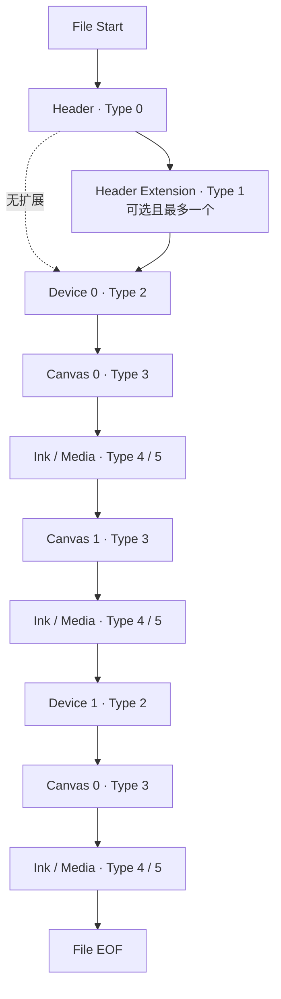

墨迹主文件（`filename.uink`）是连续的 MessagePack 对象流，保存文件元数据、设备坐标、页面/图层结构以及 Ink/Media 的混合处理顺序。

## 文件结构


```mermaid
flowchart TB
  Start["File Start"] --> H["Header · Type 0"]
  H --> HE["Header Extension · Type 1<br/>可选且最多一个"]
  H -. "无扩展" .-> D1
  HE --> D1["Device 0 · Type 2"]
  D1 --> C1["Canvas 0 · Type 3"]
  C1 --> B1["Ink / Media · Type 4 / 5"]
  B1 --> C2["Canvas 1 · Type 3"]
  C2 --> B2["Ink / Media · Type 4 / 5"]
  B2 --> D2["Device 1 · Type 2"]
  D2 --> C3["Canvas 0 · Type 3"]
  C3 --> B3["Ink / Media · Type 4 / 5"]
  B3 --> EOF["File EOF"]
```

结构规则：

1. [Header](../blocks/header)必须位于文件开头。
2. [Header Extension](../blocks/headerExtension)可选且最多一个；存在时必须紧跟 Header。
3. 第一个 [Device](../blocks/device)必须紧跟 Header Extension，或在无扩展时紧跟 Header。
4. 每个 Device 至少管理一个 [Canvas](../blocks/canvas)，其作用域到下一个 Device 或文件末尾。
5. Canvas 管理其后的 Ink/Media，直到下一个 Canvas、Device 或文件末尾。
6. 第一个 Device 前不得出现 Canvas，第一个 Canvas 前不得出现 Ink/Media。

## 文件级场景与多显示器

一个 UInk 文件只描述一个屏幕批注、白板或 PPT 宿主。场景与可选 `hostId` 写在 Header Extension，多显示器则写多个 Device。

多显示器 PPT 中，各 Device 可以包含相同 `slideId` 的独立 Canvas。它们共享同一个文件级 PPT 绑定，但坐标、内容编号和撤回历史分别属于各自 Device/Canvas。

## Canvas 结构

Canvas 的逻辑页和图层由 `pageIndex`、`layerIndex` 决定，不依赖物理块顺序。写入器应按页、层递增写入；读取器仍必须根据字段建立结构。

- Header.pageNum 是各 Device 逻辑页数之和，同页多图层不重复计数。
- 空白 Canvas 是合法页面或图层，必须保留并计数。
- Fullscreen Canvas 继承 Device 几何；Window Canvas 使用相对 Device 原点的独立几何。

## 内容顺序

同一 Canvas 中的 Ink 与 Media 必须严格按照物理块顺序混合处理。`contentId` 也必须按这一顺序从 0 连续递增。

对普通 Ink 和视觉 Media，这一顺序可以理解为由下至上的绘制顺序；对擦除 Ink，它是作用于下方内容的操作顺序。擦除具体影响哪些内容、使用裁剪、透明还是背景色，由软件决定。

```text
Ink(contentId=0) → Media(contentId=1) → Erase Ink(contentId=2) → Ink(contentId=3)
```

读取器不得先绘制所有 Media 再绘制所有 Ink，也不得仅按块类型重新排序。

## 撤回顺序

`undoId` 在同一 Canvas 的 Ink/Media 间共享，从 0 开始且只允许不递减。相同 undoId 的连续块构成一次撤回操作。

撤回或重做会改变有效历史，必须[完整重写](../incremental#必须完整重写的情况)。重写后的文件只保存当前有效内容，不承诺保存跨会话 Redo 历史。

## `.uink.extra`

Media.path 引用对应 `.uink.extra` ZIP 内的资源。ZIP 没有额外索引；所有资源顺序、几何、播放和撤回信息都由 `.uink` 中的 Media 块决定。

`.uink.extra` 缺失或资源无法读取时，基础墨迹仍必须正常加载。读取器应提示资源缺失，可以显示占位符或跳过媒体。

## 未知与损坏块

- 未知 Type ID：跳过当前 MessagePack 对象并继续。
- 缺字段的 Device：可以用当前运行环境的全屏区域和临时 UUID 加载，且不得回写容错值。
- 缺编号的 Canvas：可以按 Device 内物理顺序生成临时独立页面。
- 无效 Ink/Media：跳过单个内容块、报告警告并继续。
- 写入器必须把私有块级数据放入 `extra`；读取器仍应忽略未知顶层键。

## 完整多显示器 PPT 示例

以下伪序列展示同一 PPT 的两个显示器。两个 Canvas 使用相同 `slideId`，但属于不同 Device：

```jsonc
[
  [0, 10, "5fe30f46-be92-49b6-b921-a60706febf10", 2, 2, 1700000000],
  { "type": 1, "sceneType": 2, "hostId": "INKKEYS-PPT-7B58E2A1" },
  { "type": 2, "guid": "11111111-1111-4111-8111-111111111111", "deviceType": 0,
    "x": 0, "y": 0, "width": 3840, "height": 2160 },
  { "type": 3, "canvasId": 0, "pageIndex": 0, "pageNumber": 1,
    "layerIndex": 0, "layerNumber": 0, "slideId": 256 },
  // Device 0 的 Ink / Media
  { "type": 2, "guid": "22222222-2222-4222-8222-222222222222", "deviceType": 0,
    "x": 3840, "y": 0, "width": 1920, "height": 1080 },
  { "type": 3, "canvasId": 0, "pageIndex": 0, "pageNumber": 1,
    "layerIndex": 0, "layerNumber": 0, "slideId": 256 }
  // Device 1 的 Ink / Media
]
```

该代码只是多个 MessagePack 对象的可读表示，不表示实际文件外层还存在一个 Array。

## 相关页面

- [块类型](../type)
- [增量写入](../incremental)
- [Device 块](../blocks/device)
- [Canvas 块](../blocks/canvas)
- [Ink 块](../blocks/ink)
- [Media 块](../blocks/media)
